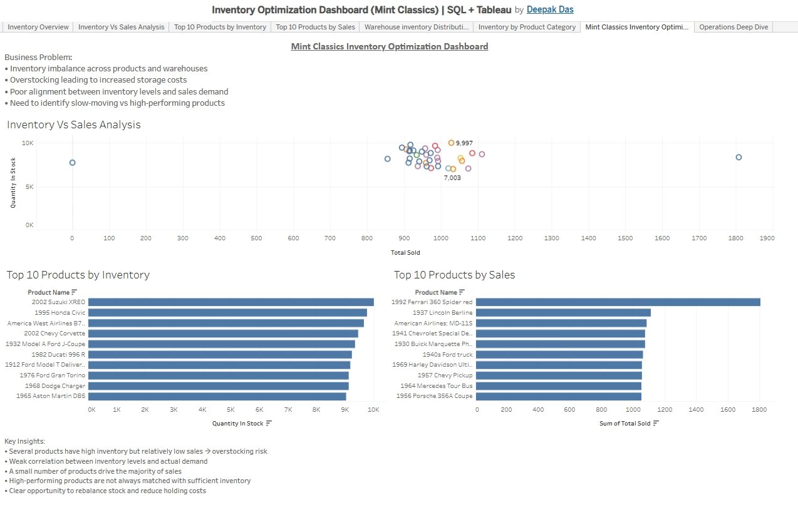

# 📦 Mint Classics Inventory Optimization (SQL-Based Business Analysis)

📌 Identified overstocking risks and demand mismatches using SQL-driven analysis to improve inventory efficiency.
📊 SQL-driven analysis to identify overstocking risks and optimize inventory efficiency in a retail business.

## 📌 Project Summary

This project simulates real-world retail inventory challenges commonly faced by e-commerce and supply chain businesses.
The goal is to align inventory levels with actual product demand and reduce unnecessary holding costs.

---

## 💼 Business Problem

Many businesses struggle with:

* Overstocking → increased storage and holding costs
* Understocking → missed sales opportunities
* Poor alignment between inventory and demand

This project addresses these issues using data-driven analysis.

---

## 🎯 Objectives

* Identify overstocked and underperforming products
* Analyze the relationship between inventory and sales
* Highlight top-performing products by revenue
* Provide insights for better inventory distribution

---

## 🛠️ Tools & Technologies

* **SQL** → Data extraction and analysis
* **Python (Pandas, Matplotlib)** → Data processing and visualization
* **Tableau** → Dashboard creation and business insights

---

## 📂 Dataset

Mint Classics dataset (simulated e-commerce inventory dataset)

---

## 📊 Dashboard Preview



---

## 📈 Key Insights

* Several products have high inventory but low sales → clear overstock risk
* Weak correlation between stock levels and actual demand
* A small percentage of products generate the majority of sales (Pareto effect)
* High-performing products are not always sufficiently stocked
* Significant opportunity to rebalance inventory across warehouses

---

## 🔑 Key SQL Highlight

This query highlights products with excess inventory compared to actual sales, helping identify overstocked items.

stock_difference = inventory - sales
```sql
SELECT 
    p.productName,
    p.quantityInStock,
    SUM(od.quantityOrdered) AS total_sold,
    (p.quantityInStock - SUM(od.quantityOrdered)) AS stock_difference
FROM products p
JOIN orderdetails od 
    ON p.productCode = od.productCode
GROUP BY p.productName, p.quantityInStock
ORDER BY stock_difference DESC;
```

---

## 🧠 Business Recommendations

* Reduce stock for low-performing, overstocked products
* Increase inventory for high-demand items to prevent stockouts
* Implement demand-based inventory planning
* Continuously monitor inventory vs sales trends

---

## 📊 Key Metrics Analyzed
- Inventory vs Sales Ratio  
- Stock Difference (Inventory - Sales)  
- Revenue Contribution by Product  
- Warehouse Distribution Efficiency

---

## 📌 Conclusion

This analysis identified key inefficiencies in inventory management, including overstocked products and mismatches between supply and demand. By leveraging SQL-based analysis and data visualization, the project highlights opportunities to optimize stock levels, improve warehouse distribution, and enhance overall operational efficiency.

The findings demonstrate how data-driven decision-making can significantly reduce costs and improve business performance.

---

## 🚀 Project Structure

├── analysis.ipynb
├── Inventory_vs_Sales.csv
├── product_inventory.csv
├── sales_per_product.csv
├── warehouse_inventory.csv
├── dashboard-overview.jpg
└── dashboard-insights.jpg

---

## 👤 Author

**Deepak Das**

---

## ⭐ Why This Project Matters

This project demonstrates practical skills in:

* SQL-based data analysis
* Business problem-solving
* Data visualization and storytelling

It reflects how data can be used to make smarter operational decisions in real-world scenarios.
